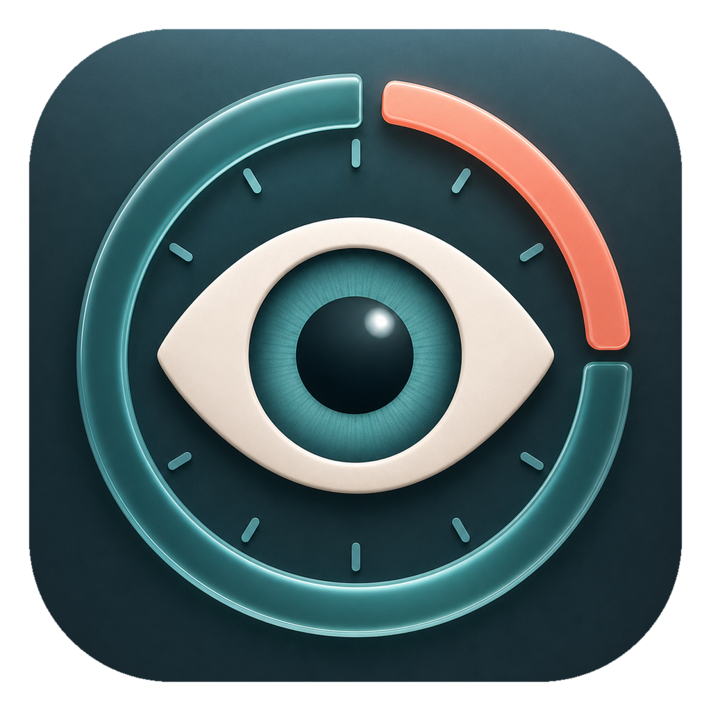

<p align="center">
  
</p>

<h1 align="center">FocusBreak</h1>

<p align="center">
  A free macOS menu-bar break reminder for developers and office workers.
</p>

<p align="center">
  <a href="https://github.com/erdeme36/FocusBreak/releases/latest">Download latest release</a>
</p>

FocusBreak is a free macOS break reminder for developers and office workers who spend long stretches in front of a screen.

It lives in the menu bar, keeps a simple countdown, and nudges you into short eye breaks or longer reset breaks without turning your workflow into a productivity dashboard.

## Why

Long, uninterrupted screen sessions can contribute to eye strain symptoms such as dryness, burning, blurred vision, headaches, and neck or shoulder tension. FocusBreak does not make medical claims; it helps you build a practical break habit based on common eye-care and micro-break guidance.

Research basis:

- [American Optometric Association](https://www.aoa.org/healthy-eyes/eye-and-vision-conditions/computer-vision-syndrome/) - computer vision syndrome and the 20-20-20 approach.
- [Mayo Clinic](https://www.mayoclinic.org/diseases-conditions/eyestrain/diagnosis-treatment/drc-20372403) - regular eye breaks, blinking, and screen ergonomics for eye strain.
- [CDC/NIOSH](https://www.cdc.gov/niosh/blogs/2020/working-from-home.html) - work-from-home ergonomics and short breaks.
- [Micro-break meta-analysis](https://pmc.ncbi.nlm.nih.gov/articles/PMC9432722/) - evidence that short breaks can reduce fatigue and support well-being.

## Features

- Menu bar eye icon with a compact timer menu.
- Main macOS window with daily break counters, next-break timer, research explanation, and settings.
- 20-20-20 eye break mode: every 20 minutes, look away for 20 seconds.
- Long break mode: default 5-minute break after 60 minutes of focus.
- Pomodoro mode: focus and short-break cycle as a separate rhythm.
- Gentle or insistent reminder style.
- Full-screen blur overlay for longer breaks.
- Pause, resume, skip, and snooze controls.
- Launch-at-login support.
- Startup and manual update checks from the public GitHub release.
- Free unsigned sharing through `.app` or `.dmg`.
- Local-first behavior with no analytics or account requirement.

## Install

Download `FocusBreak.dmg` from the release, open it, then drag `FocusBreak.app` into `Applications`.

Because the app is unsigned and not notarized, macOS may show an "unidentified developer" warning. Use right click > Open the first time if needed.

FocusBreak checks the public GitHub release on startup. If a newer version exists, it can download the latest DMG to your Downloads folder and open it so you can drag the new app into Applications.

If macOS says the app is "damaged" after downloading, it is usually Gatekeeper quarantine on an unsigned build. Move the app to `Applications`, then run:

```bash
xattr -dr com.apple.quarantine /Applications/FocusBreak.app
```

After that, open it with right click > Open. A Developer ID signed and notarized build would avoid this extra step, but it requires an Apple Developer Program account.

## Build Locally

Requirements:

- macOS 13+
- Xcode command line tools
- Swift Package Manager

Run tests:

```bash
swift test
```

Build the app bundle:

```bash
./scripts/package_app.sh
```

Create the installer DMG:

```bash
./scripts/package_dmg.sh
```

Artifacts are written to:

```text
dist/FocusBreak.app
dist/FocusBreak.dmg
dist/FocusBreak-Installer.dmg
```

## Distribution

The first version is designed for free sharing without an Apple Developer account.

You can share:

- `FocusBreak.dmg` - easiest for friends, includes drag-to-Applications install screen.
- `FocusBreak.app.zip` - direct app bundle archive.
- The source project - friends can build locally with SwiftPM.

Professional external distribution would ideally use Developer ID signing and notarization, but that requires the Apple Developer Program.

Useful Apple references:

- [Developer ID](https://developer.apple.com/support/developer-id/)
- [Distributing macOS apps](https://developer.apple.com/macos/distribution/)

## Privacy

FocusBreak is local-first. It does not require an account, does not include analytics, and does not send your break settings or usage data to a server.

See [PRIVACY.md](PRIVACY.md) for the short privacy note.

## Product Notes

Good next steps before selling or wider public distribution:

- Add Developer ID signing and notarization so macOS opens the app with fewer security warnings.
- Add a license or commercial terms before broad public release.
- Add a small website or landing page with the research basis, screenshots, and direct release download.
- Consider a paid Pro version only after the free version feels reliable for daily use.

## GitHub Description

Free macOS menu-bar break reminder for developers and office workers, with 20-20-20 eye breaks, long breaks, Pomodoro mode, and shareable DMG builds.

## License

FocusBreak is released under the [MIT License](LICENSE).
